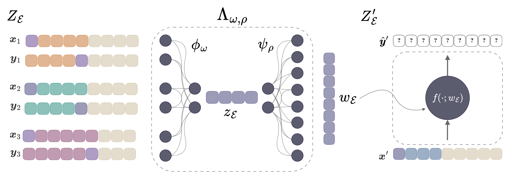

# on-the-fly-models

Code for the paper *On-the-fly Weight Generation: A Hypernetwork Proof of Concept on ARC-1D*
(link coming soon).

**Can a network write the weights of a small model for a task it is shown, instead of us
training one model per task?**

The tasks come from [1D-ARC](https://github.com/khalil-research/1D-ARC): short
one-dimensional puzzles such as "move the block one step right", "fill the gap" or "mirror
the pattern" (14 task types are used). Each task comes with three input-output examples and
a query input to solve.

A **hypernetwork** reads the three examples and generates all the weights of a tiny
Transformer (about 1,200 parameters), which then solves the query. We compare it with
training one small model per task type and with one shared model trained on every task, and
ask when generating weights helps.

<p align="center">
  <picture>
    <source media="(prefers-color-scheme: dark)" srcset="docs/hypernetwork-dark.png">
    
  </picture>
  <br>
  <em>An encoder φ<sub>ω</sub> reads the three examples Z<sub>ℰ</sub> and summarises the task
  as a vector z<sub>ℰ</sub>. A decoder ψ<sub>ρ</sub> turns z<sub>ℰ</sub> into every weight
  w<sub>ℰ</sub> of a small Transformer f. Once generated, f needs no examples: given only a
  new input x′, it predicts the output ŷ′.</em>
</p>

## Reproduce

```bash
# 1. Install (creates .venv)
uv sync --python 3.12 --managed-python

# 2. Build the data (deterministic, a few minutes on CPU)
uv run python -m scripts.build_arc_1d
uv run python -m scripts.augment_arc_1d --per-pair --n-color-permutations 199 \
    --shifts 1 2 -1 -2 --no-mirror --dev-test-n-permutations 19 \
    --output-dir data/arc_1d_looped_augmented
uv run python -m scripts.build_arc1d_compositional

# 3. Run an experiment, then make its figures (here experiment 1)
bash experiments/01_multitask_capacity/run.sh
uv run python experiments/01_multitask_capacity/plot_all.py --outputs-dir outputs
```

Every experiment works the same way: one `run.sh`, then its plot script. Results, trained
models and figures are written to `outputs/`. Runs log to Weights & Biases; set
`WANDB_MODE=offline` to keep them local.

By default `run.sh` runs one job at a time on your GPU. The models are tiny (a job uses about
350 MB of GPU memory, 1 CPU core and 3 to 5 GB of RAM), so run several jobs per GPU with
`JOBS_PER_GPU=4`, and use every GPU with `GPUS=all` (or a list such as `GPUS=0,1`).

## Experiments

### Capacity and proof of concept

| | Hypothesis | Finding |
|---|---|---|
| [1](experiments/01_multitask_capacity/README.md) | A tiny model (1.4K parameters) can learn any one task type; can it learn all 14 at once? | No: trained on one type at a time it solves every type, but trained on all 14 together it fails. A larger joint model (9.5K parameters) closes the gap. So can we generate a tiny, fast, deployable model for each task instead? |
| [2](experiments/02_hypernetwork_multitask/README.md) | Can a hypernetwork generate the weights of a model that solves all 14 task types? | Yes, with task identity: one shared hypernetwork matches one model per type (93.0% vs 92.6%) |

### Generalisation

| | Hypothesis | Finding |
|---|---|---|
| [3](experiments/03_reusability_generate_once_execute_many/README.md) | Do generated weights capture the task's rule, or only the instance they were generated from? | The rule: reused on other instances of the same type, they lose about 2 points (94.0% to 91.8%), with or without task identity |
| [4](experiments/04_compositional_generalization/README.md) | Can a hypernetwork generalise to unseen combinations of known rules, and does task identity help? | Partly, and better without task identity. Token accuracy 75.5% vs 67.7%, ahead in 8 of 10 types. Exact match stays near zero: 1.0% vs 0.05%, ahead in 3 types, behind in 1, both 0% in 6 |
| [5](experiments/05_leave_one_out_task_generalization/README.md) | Can a hypernetwork generalise to a task type unseen in training, and does task identity help? | Partly, and better without task identity. Token accuracy 81.6% vs 67.5%, ahead in 13 of 14 types. Exact match 10.2% vs 0.4%, ahead in 6 types, behind in 1, both 0% in 7 |

### Data efficiency

| | Hypothesis | Finding |
|---|---|---|
| [6](experiments/06_data_efficiency_ablation/README.md) | Does sharing parameters across tasks give the hypernetwork an advantage when training data is scarce? | Not at this scale: with task identity, it stays within a few points of one model per type at every data size |

Run experiment 2 before 3 and 4, which evaluate its models. Each experiment's README has the
full setup, commands, figures and results; [`experiments/README.md`](experiments/README.md)
covers running on several GPUs or nodes, the output layout and the config format.

## Compute

Every run uses one GPU. Times are wall-clock minutes per run on one NVIDIA A40, including data
setup and evaluation; GPU-hours are the sum over all runs.

| Experiment | Runs | Minutes per run | A40 GPU-hours |
|---|---:|---|---:|
| 1 | 960 | 2.5 to 3.6 (individual), 9 to 10 (joint) | 64 |
| 2 | 10 | 24 | 4 |
| 3 | 10 evaluations | 0.4 | 0.1 |
| 4 | 10 evaluations | 0.7 (CPU) | 0 |
| 5 | 140 | 23 | 53 |
| 6 | 870 | 7 to 109, by arm and data level | 340 |
| **All** | **1,980** | | **461** |

Each run writes its own `compute.json` (GPU model and minutes);
`python scripts/compute_cost.py` totals them per experiment.

## Code

```text
models/              the networks: Transformer, hypernetwork, embeddings
lightning_modules/   training: direct models and the hypernetwork
data_modules/        the ARC-1D datasets
experiments/         one folder per experiment: configs, run.sh, plots, README
scripts/             data build, the shared launcher, evaluation scripts
train.py             trains one config: python train.py --config <file>.yaml
tests/               uv run pytest (see tests/README.md)
```
