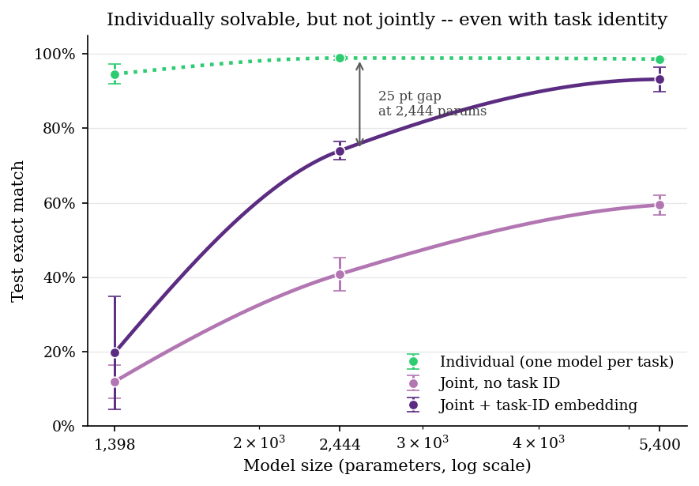

# Experiment 2: multi-task capacity

**Question**: can one small model learn all 14 ARC-1D tasks *jointly* (a
single shared weight set, no per-task model), with and without a per-task
identity signal? Full background: `docs/arc1d_story/06_phase1_findings.md`.

## The plot



X-axis is total parameter count (the same RoPE+Canon architecture at three
widths, `hidden_dim` 4/6/10, `embedding_dim` fixed at 10 throughout for
comparability). Y-axis is test-split exact match. Solid lines are joint
training (one shared model across all 14 categories); the dotted line is
individual training (one model per task, no sharing). Colour separates the
two joint arms: light purple has no task signal, dark purple has a per-task
identity embedding.

Regenerate with:

```bash
uv run python scripts/plot_capacity_cliff.py \
    --outputs-dir outputs \
    --out-dir configs/experiments/arc1d_v2_multitask
```

## The finding

Individual training saturates almost immediately -- 94.6% at 1,398 params,
98.9% at 2,444, 98.6% at 5,400. Joint training does not, even with task
identity:

| params | Individual | Joint, no task ID | Joint + task-ID embedding |
|---:|---:|---:|---:|
| 1,398 (dim=4) | 94.6% (n=5) | 12.0% (n=5) | 19.7% (n=5, unstable: 4.3-48.6%) |
| 2,444 (dim=6) | 98.9% (n=5) | 40.9% (n=5) | 74.0% (n=5) |
| 5,400 (dim=10) | 98.6% (n=3) | 59.4% (n=5) | 93.1% (n=5) |

The sharpest single-size demonstration is at **2,444 params**: individual
training is already fully saturated there (98.9%, matching the 5,400-param
ceiling), but joint training with task identity is still 25 points behind
(74.0%). Task identity alone cannot close that gap at this size -- there is
a real model-capacity regime that solves every task *alone* but cannot hold
them *together*, even when told which task it's looking at.

This motivates the hypernetwork: a mechanism that generates per-task
weights, rather than sharing one fixed set across tasks.

## Method

- **Individual**: one model per task category, no cross-task sharing (the
  Phase 1 recipe). dim=6/4 from `configs/experiments/arc1d_v2_minimal_size/`;
  dim=10 from `configs/experiments/arc1d_v2_backbone_capacity/` (RC1, the
  original Phase 1 run -- 3 seeds instead of 5).
- **Joint, no task ID** (`notd*.yaml` here): one model trained across all 14
  categories at once, no task signal.
- **Joint + task ID** (`td*.yaml` here): same joint setup, plus a per-task
  `nn.Embedding(18, 10)` looked up via `TASK_CATEGORY_INDEX` and added into
  the token embeddings before the backbone
  (`models/direct_supervised_lightning.py`,
  `task_encoding.use_task_embedding: true`), mirroring the hypernetwork's
  `task_indicator_proj` (`models/hypermodel.py`).
- All test-split exact match (`train_split=train`, `val_split=dev` for
  monitoring only -- no checkpoint selection since `save_checkpoints: false`
  everywhere in this project -- `test_split=test` reported once at the end).
- RoPE + Canon backbone, Muon optimizer (`muon_lr=0.005`,
  `muon_momentum=0.95`), flat (`n_loops=1`), `N_sup=1`, `max_steps=8000`.
- 5 seeds per condition/size (dim=10 individual: 3, from the original run).

## Configs in this folder

| File | Condition | Size |
|---|---|---|
| `notd.yaml` / `td.yaml` | Joint, no ID / with ID | dim=10 |
| `notd_dim6.yaml` / `td_dim6.yaml` | Joint, no ID / with ID | dim=6 |
| `notd_dim4.yaml` / `td_dim4.yaml` | Joint, no ID / with ID | dim=4 |
| `overfit/td_overfit.yaml` | sanity check for the task-embedding code path | dim=10, 3 categories |
